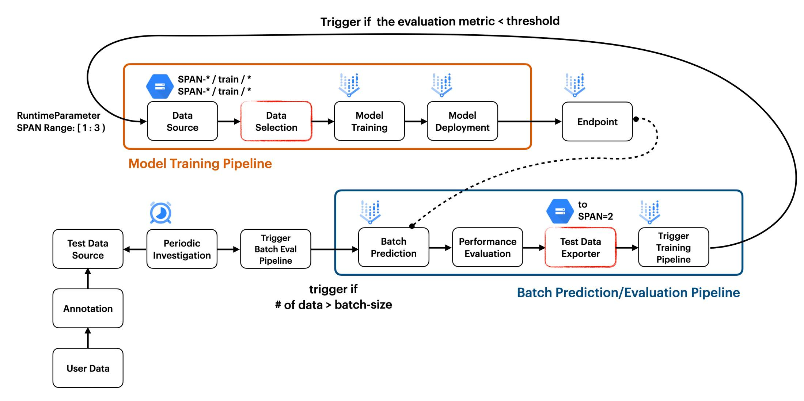

# Continuous Adaptation for Machine Learning System to Data Changes

_By [Chansung Park](https://github.com/deep-diver) and [Sayak Paul](https://github.com/sayakpaul)_

MLOps system evolves according to the changes of the world, and that is usually caused by [data/concept drift](https://en.wikipedia.org/wiki/Concept_drift). This project shows how to combine two separate pipelines, one for batch prediction and the other for training to adapt to data changes. _**We are currently working on a blog post to discuss our experience and the technical details of the project. Stay tuned.**_ We assume familiarity with basic MLOps concepts (like pipelines, data drift, batch predictions, etc.), TensorFlow, TensorFlow Extedned, and Vertex AI from the reader.

MLOps system also can be evolved when much better algorithm (i.e. state-of-the-art model) comes out. In that case, the system should apply a better algorithm to understand the existing data better. We have demonstrated such workflows in the following projects:

* Model Training as a CI/CD System Part1: Reflect changes in codebase to MLOps pipeline: [Code on GitHub](https://github.com/deep-diver/Model-Training-as-a-CI-CD-System), [Article on the GCP blog](https://cloud.google.com/blog/topics/developers-practitioners/model-training-cicd-system-part-i)
* [Model Training as a CI/CD System Part2: Trigger, schedule, and run MLOps pipelines: [Code on GitHub](https://github.com/sayakpaul/CI-CD-for-Model-Training), article coming soon.

## Workflow

1. Run the initial training pipeline to train an image classifier and deploy it using TensorFlow, TFX, and Vertex AI ([`02_TFX_Training_Pipeline.ipynb`](https://github.com/deep-diver/Continuous-Adaptation-for-Machine-Learning-System-to-Data-Changes/blob/main/notebooks/02_TFX_Training_Pipeline.ipynb)).
2. Download and prepare images from Bing search to simulate the data drift ([`97_Prepare_Test_Images.ipynb`](https://github.com/deep-diver/Continuous-Adaptation-for-Machine-Learning-System-to-Data-Changes/blob/main/notebooks/97_Prepare_Test_Images.ipynb)).
3. Generate batch prediction pipeline specification (JSON) ([`03_Batch_Prediction_Pipeline.ipynb`](https://github.com/deep-diver/Continuous-Adaptation-for-Machine-Learning-System-to-Data-Changes/blob/main/notebooks/03_Batch_Prediction_Pipeline.ipynb)).
4. Deploy cloud function to watch if there are enough sample data to perform batch prediction pipeline and to trigger the batch prediction pipeline ([`04_Cloud_Scheduler_Trigger.ipynb`](https://github.com/deep-diver/Continuous-Adaptation-for-Machine-Learning-System-to-Data-Changes/blob/main/notebooks/04_Cloud_Scheduler_Trigger.ipynb)).
5. Schedule a periodic job to run the deployed cloud function ([`04_Cloud_Scheduler_Trigger.ipynb`](https://github.com/deep-diver/Continuous-Adaptation-for-Machine-Learning-System-to-Data-Changes/blob/main/notebooks/04_Cloud_Scheduler_Trigger.ipynb)).

## Custom components

We developed several custom components in TFX for this project. You can find them under the `custom_components` directory.

## Checklist

- [X] Initial Data Preparation (CIFAR10)
- [X] Build Training Pipeline
- [X] Build Batch Prediction Pipeline
  - [X] FileListGen component
  - [X] BatchPredictionGen component
  - [X] PerformanceEvaluator component
  - [X] SpanPreparator component
  - [X] PipelineTrigger component
- [X] Data Preparation for Data/Concept Drift Simulation (from Bing)
- [X] Deploy Cloud Function, Schedule a Job to Trigger the Cloud Function
- [X] End to End Test

## Feedback

We welcome feedback. Please create an issue to let us know what you think.

## Acknowledgements

* [ML-GDE program](https://developers.google.com/programs/experts/) for providing GCP credits.
* Robert Crowe and Jiayi Zhao of Google for helping us with our technical doubts. 
